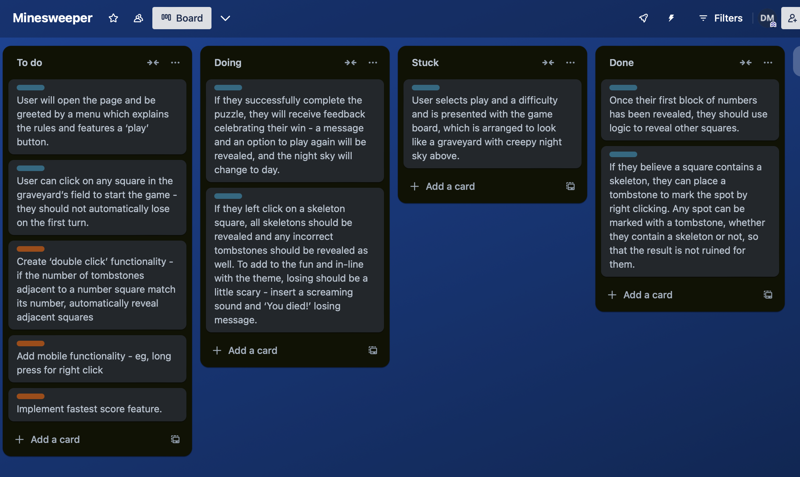

# 💀 Minecreeper - a minesweeper game


### Deployment link
- [Minecreeper](https://david-millett.github.io/minecreeper/)

### Timeframe
- 5 days

### Working team
- Solo project

## Description

*Minecreeper* is a browser-based minesweeper-style game with a horror twist! While the traditional game tasks players with avoiding mines and setting down flags in their places on the grid-based board, *Minecreeper* substitues mines for undead skeletons - and the flags for tombstones.

Upon opening the game, players are met with a menu detailing the game's simple backstory and instructions on how to play. Players click to reveal squares on the game's field, which is styled as a graveyard. Revealed squares display a number which represents how many skeletons can be found next to it. If a square with no adjacent skeletons is selected, the game will automatically reveal all adjacent squares using a flood fill function.

The first click is set to always implement this flood fill function so that the player gets a good start and to make playing the game more fun. Players right-click to set down a tombstone to mark where they believe a skeleton is hiding. For me, especially when playing minesweeper on higher difficulties, I think having the ability to double click on a revealed square to reveal all nearby squares when you have set down the required number of tombstones makes the game much more fun and fast paced - so I am pleased to also include this feature in *Minecreeper*.

Upon winning or losing the game, the player is greeted with an appropriate sound effect and visual changes to the 'sky' above the graveyard.

## Technologies used

* HTML
* CSS
* JavaScript

Developed in *VS Code*. Visual assets edited using *Procreate*.

## Brief

This project was compeleted in response to a brief to create a browser-based game as part of a software engineering bootcamp course at General Assembly.

The minimum requirements were:
* The game must be rendered in the browser using DOM manipulation techniques
* The game must have a win/lose condition with appropriate messages rendered in *HTML*
* It must include separate *HTML*, *CSS*, and *JavaScript* data files
* It must be deployed online so the world can play it

Over the course of a week, I was tasked with:
* Planning the project
* Creating a *GitHub* repo to host the project
* Building the project
* Deploying the game
* Presenting the project

## Planning

Before embarking on the project, I wrote a comprehensive plan of how the game would work including user stories, pseudocode, and mock-up/wire frame.

### Wire frame/design

From the outset, I had a clear vision for how I wanted the game to look and feel. I decided on a pixel art style using a dark cartoony colour pallette to match the theme. I envisioned the game's field as a literal graveyard, adding the sky on top to enhance the effect. The initial layout was conceived and drawn on some scrap paper while I was on a long train ride from Yorkshire to London!


This idea was then developed further and mocked up in *Figma* to produce a wireframe of the game and its various win/lose/menu screens. This really helped me enter the project with a clear view and intention of what I wanted to create.


### User Stories

I broke my user stories down into steps which I compiled into *Trello* to track individual tasks as I progressed with the project.



### Psuedocode

I wrote as detailed a plan of my pseudocode as I could before getting started, so that I knew what steps I would have to take.


After all that, I was raring to get started!

## Build/code process

My step-by-step process was to make a functioning game first, using only basic CSS that demonstrated my code was behaving as intended. Once I had the core game working and allowing players to win or lose, I could add the bulk of the styling and additional functionality, such as the modal menu, sound effects, and additional difficulties.

### My main functions

To me, it was clear that I needed four major functions for the basic game to work:

* A function to initialise the game upon loading
* A function to handle clicking on the game's squares
* A function to handle right clicking
* A function to handle double clicking

### Step 1 - Initialising the game

As each of these functions needed to handle quite a lot of actions, I broke each of them down into smaller steps of individual helper functions. This allowed these main functions to look neater and more organised, but also gave me a logical step-by-step method of adding each function.

My `init()` function is comprised completely of helper functions that each perform their own individual task:

```JavaScript
const init = () => {
    resetVariables()
    generateBoard()
    createEventListeners()
    getNeighbours()
    placeSkeletons()
    calcNearbySkeletons()
    updateCounter()
}
```
I started by coding the `init()` function to generate a beginner difficulty-sized board. I experimented with a few ways of generating the gameboard, and settled on using a `for` loop to generate the required number of cells as a new `<div>`. At the same time, I created an array of objects, each of which stored the new `<div>` and a host of other information that the game would require later. These were added to my `board` array.

```JavaScript
const generateBoard = () => {
    for (let i = 0; i < numberOfCells; i++) {
        const cell = document.createElement("div")
        cell.classList.add("cell")
        cell.id = i
        cell.style.height = `${100 / numberOfRows}%`
        cell.style.width = `${100 / numberOfColumns}%`
        const cellObj = {
            cell,
            isSkeleton: false,
            revealed: false,
            skeleCount: 0,
            tombstone: false,
            tombCount: 0,
            neighbours: [],
        }
        board.push(cellObj)
        gameboardEl.appendChild(cell)
    }
}
```

A breakthrough at this stage was deciding to store an array of each cell's neighbours within the object - this really helped me visualise how many future functions of the game would work, including `calcNearbySkeletons()`, an essential function I used to work out the `skeleCount` of each cell, aka the number of adjacent skeletons. I created a function called `getNeighbours()` to add each cell's neighbours to the array. This is probably my least 'dry' function, as not all cells have the same number of neighbours - the ones on the edges have fewer. I therefore used the approach I did to ensure no errors were produced, but I would like to investigate more efficient ways of doing this.

To assign the skeleton locations, a function utilising a `while` loop and `Math.random()` was used:

```JavaScript
const placeSkeletons = () => {
    let skeletonsPlaced = 0
    while (skeletonsPlaced < numberOfSkeletons) {
        const placement = Math.floor(Math.random() * numberOfCells)
        if (!board[placement].isSkeleton) {
            board[placement].isSkeleton = true
            board[placement].cell.classList.add("skeleton")
            skeletonsPlaced++
        }
    }
}
```
The `if` statement ensured that the loop would keep going in cases where it generated the same number twice so that the required number of skeletons was always created.

At this stage in development, I relied on `console.log()` and `console.dir()` a lot to see what was happening behind the scenes and ensure everything was working as intended.

### Step 2 - Handle click

The main way players interact with the game is through clicking on squares, for which I created a `handleClick()` function. One of the most important aspects of this function is to 'reveal' the cell that the player clicks on. I implemented this by making it so that clicking changed the `revealed` element within the cell's object to become `true` and sets the `innerHTML` to its `skeleCount`.

A key aspect of minesweeper is its 'flooding' mechanism. This means that when a cell with no adjacent skeletons (or mines) is pressed, all the nearby cells are automatically revealed. I had to research and implement recursion for my game to handle this:

```JavaScript
const revealCell = (idx) => {
    board[idx].revealed = true
    if (board[idx].skeleCount === 0 && !board[idx].isSkeleton) {
        board[idx].neighbours.forEach((neighbour) => {
            if (!board[neighbour.cell.id].revealed) {
            revealCell(neighbour.cell.id)
        }
        })
    }
}
```

As can be seen above, the `revealCell()` function calls itself if it has no adjacent skeletons (a `skeleCount` of `0`) and it is not an assigned skeleton square. After a little tinkering, I found  that adding an `if` statement checking whether the cell had already been revealed was necessary to ensure the function wouldn't go on infinitely and crash the browser.

The `handleClick()` function also calls the `checkWin()` and `checkGameOver()` functions. This is so that the player can get instant feedback after their turn on whether they have won or lost the game.

The game over condition was easy to solve - if a square is flagged as both `revealed` and `isSkeleton`, the game is over. The win condition was a little trickier to solve - in the end I settled on generating a `winCheck` number. This number adds up the total number of squares that have been revealed or are flagged as skeletons. If this number equals the total number of squares in the grid, the player has won the game.

```JavaScript
let winCheck = 0
    board.forEach((square) => {
        if (square.revealed || square.isSkeleton) {
            winCheck ++
        }
    })
    if (winCheck === numberOfCells) {
        youWin = true
    }
```

### Step 3 - Handle right click

The `handleRightClick()` function allows the player to toggle tombstones onto that square, and is relatively simple compared to the previous two main functions. It also reduces the counter visible in the upper left corner of the game.

At this point, the game was functional at a simple level. This meant I could go in and add more advanced features.

### Step 4 - Advanced features

I used recursion again in my `firstReveal()` function. This function ensured that the first click could never give players a game over and would always land on a square with no adjacent skeletons. This means they would always be given a 'block' of cells to get started with, which I think makes the game more fun and less frustrating. It was really important to me that losses held meaning - I didn't want them to feel cheap or unfair.

I also implemented the `handleDoubleClick()` function, which, as I mentioned earlier, I think makes the game much more fun and fast paced - especially on higher difficulties with a bigger board! I am a huge fan of minesweeper, so I have played it a lot and knew I had to include this feature. This relied on running a simple check to see whether the number of adjacent skeletons matched the number of adjacent tombstones.

I also put new difficulties into the game, which required dynamically changing various parameters and the size of certain elements.

### Step 5 - Styling

It was at this later stage that I started to transform the game into how I wanted with *CSS*. I really wanted to instill several distinct vibes into the game, including tongue-in-cheek/shlocky horror and retro arcade style. This informed the visual look of the game and my audio choices. All images are pixel/bit style, which I think meshes well with minesweeper, as the board is itself composed of squares. To give the game life, I used gifs in some cases and created my own animations in others - for example to make it look like the tombstones were glowing. This was achieved by creating different stills which were then linked together using `#keyframes` in *CSS*.

Sound effects were added, including a shrill scream when players lose. A fast paced bit-tune style soundtrack was selected - I really wanted to instil a sense of urgency and frenetic energy into the game, which I hope this music helps achieve!

One of the final features added into the game was the setting 'the sky' to dynamically change when the player wins or loses.

## Challenges

The parts of the project that I anticipated to be the sticking points actually ended up going quite smoothly - it was parts I wasn't expecting that caused the most problems.

### Adding replay functionality

Probably the most game-breaking moment throughout the project was trying to implement the ability to 'replay' the game and change the difficulty. At first, when I tried to implement the replay, I kept generating multiple non-functioning boards on the screen. The problem was that I wasn't resetting all of the game's variables properly. This led me to include a new `resetVariables()` function at the beginning of the `init()` function to ensure everything was comprehensively wiped clean and set to its initial value. 

```JavaScript
const resetVariables = () => {
    gameboardEl.innerHTML = ''
    board = []
    messageEl.textContent = ''
    youWin = false
    gameOver = false
    theMoon.style.display = "inline"
    theSun.style.display = "none"
    bloodMoon.style.display = "none"
    theSky.style.backgroundColor = "rgb(65, 90, 152)"
}
```
It took some trial and error to ensure that everything that had been changed throughout playing the game was reset to a clean slate.

I also learned that I needed to create a function to re-generate the event listeners attached to the cells of the grid - because the old ones stopped working once the original grid had been destroyed by the `resetVariables()` function. This led to the `generateEventListeners()` function being added beneath it within the `init()` function. Although a struggle at the time, I feel like I learned a lot during this stage of development. Sorting the reset functionality also allowed me to then implement the change difficulty settings properly, as they relied on resetting the board first to work.

## Wins

This was my first ever coding project, so I felt a real sense of accomplishment upon completing it.

### Adding double click

I am proud of being able to add the double click functionality and making it so that the first click always produces a block of squares, as these were more advanced features. Implementing the double click was very smooth and quick - it was satisfying because I felt I understood a lot about my game at this point and how it worked. I had to add extra functionality to several previous lines of code to make it work. This included adding a nearby tombstone count to each object - because I had already done something similar with the nearby skeleton count, it was easy to replicate this.

### Atmosphere

I am very pleased with the final look and feel of the game, which I hope achieved what I set out to create. I think the visual *win* and *loss* screens are really effective and communicate the state of the game in an appealing and fun way.


I think that one of the highlights of minesweeper is its ability to startle the player when they lose - it requires such a degree of concentration and creates such a sense of anticipation that an unexpected loss can make the player jump. I am really happy with the visuals and audio of my loss screen to create this feeling in players. In addition, I think the changing sky also feeds into the storytelling of the game. This is established in the game's opening menu, which made my test players smile upon reading it. At the end of the day, a game should be enjoyable and fun - and that's what I wanted to make, so... mission accomplished!

## Key learnings/takeaways

As this was my first major project, I learned a lot.

* 📝 **Plan, plan, plan** - I had a strong plan going in to the project, but now I understand very well why this step is important to allow for plain sailing during the process - I am very convinced of how essential this step is for future projects.

* ⚡️ **Recursion and new ideas** - I encountered recursion for the first time in this project, and ended up implementing it twice. I feel like I understand this complex idea much better now.

* [{}] **Arrays of objects** - Because my board was an array of objects, I learned a lot about these in and became much more confident in using them and accessing information from them. I needed to reference specific elements within specific objects in the array many times, which made doing so feel more natural as time went on.

* 🔁 **Resetting variables** - I have also realised importance and extent required to fully reset variables before reinitialising an app.

* 🤩 **Confidence boost!** - Finally, going in to this project was like stepping in to the unknown. Before I got started, I had some anxiety about my ability to complete it. Working on it to completion has boosted my confidence greatly - and made me realise that with a little research, problem solving, and an end goal in mind, it is possible to take on complex coding tasks succesfully.

## Bugs

The game performs as intended in Chrome, but some audio and visual effects may not display properly in other browsers.

## Future improvements

* ⏳ **Timer and scoreboard**  - As mentioned above, I really wanted to instil a sense of urgency in players while playing the game. Adding these will add to this feeling as players try beat their scores.

* 📱 **Mobile functionality** - there is no right click on mobile, so this could be substitued with a long press. Ensuring that the board scales well to a mobile screen may also required some work.

* 😡 **Avoid cheap losses** - Minesweeper on higher difficulties has a tendency sometimes to create scenarios where it is impossible for a player to deduce which of two squares features a skeleton/losing square. This forces them to guess - and potentially lose. This feels cheap and disatisfying. To combat this, I thought about giving players a one-time 'special power' to highlight two squares before revealing them.

* 📈 **Progressive levels** - To build on the game's story, there could be sequential levels of difficulty building up to an overall conclusion.

* 💡 **Other ideas** - There are many other ideas I had for the game. For example, generating messages of encouragement as the player reveals more squares, revealing skeletons one-by-one upon a loss, and more!